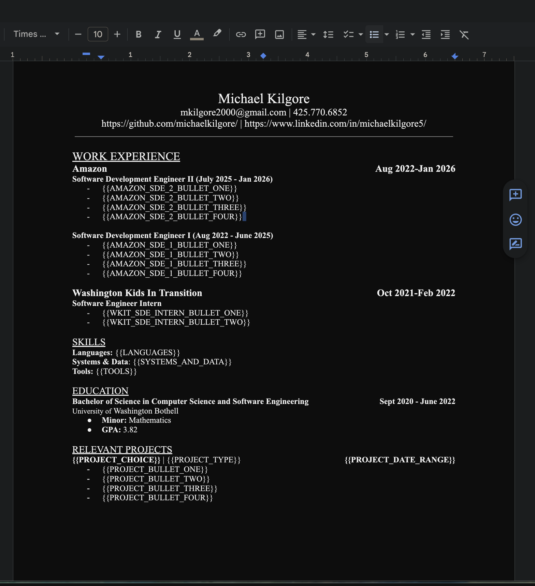

# ResumeAndCoverLetterCurationApp

### How it Works

The purpose of this script is to automate the process of keyword matching similar to Job Scan. I found that a lot of times you are just rewording bullet points so this script automates that process. When you apply for a new job, look at the keywords you are missing and create new bullet points with the missing keywords, and over time your database will grow and you won't have to add new bullet points all the time.

### Set Up Instructions

create template like:

copy paste the TEMPLATE ID into global variable at top of src/create_google_doc.py

Then paste job description into job_description.txt file.

set up your data in const/data.json

Finally make sure to set up authentication for google doc. (I won't go into details just ask chatgpt)

After you've done that you can just run src/create_google_doc.py and it should work.

### Additional Notes

I didn't make this application flexible. I only solved my use case. For me currently I have 3 jobs of history and a project of history you will want to update _get_replacements accordingly to suit your use case most likely.

